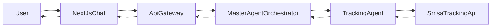

### Tracking Agent End-to-End Flow

The Shipment Tracking Agent (Agent 1) handles all AWB-based tracking requests from the web/mobile chat through the gateway to the AI engine and SMSA APIs.

**Request path:**
- Frontend → `POST /api/messages/:conversationId/stream` (gateway)
- Gateway → `POST /orchestrator/chat` (AI engine, FastAPI SSE)

**Core payloads:**
- `ChatMessageRequest`:
  - `conversationId: string`
  - `userId?: string`
  - `message: string`
  - `explicitIntent?: "TRACKING"`
- `TrackingSseEvent`:
  - `type: "token" | "done" | "error"`
  - `content: string`
  - `metadata`:
    - `agent: "tracking"`
    - `timestamp: string (ISO)`
    - `conversationId: string`

#### Data Flow Diagram

